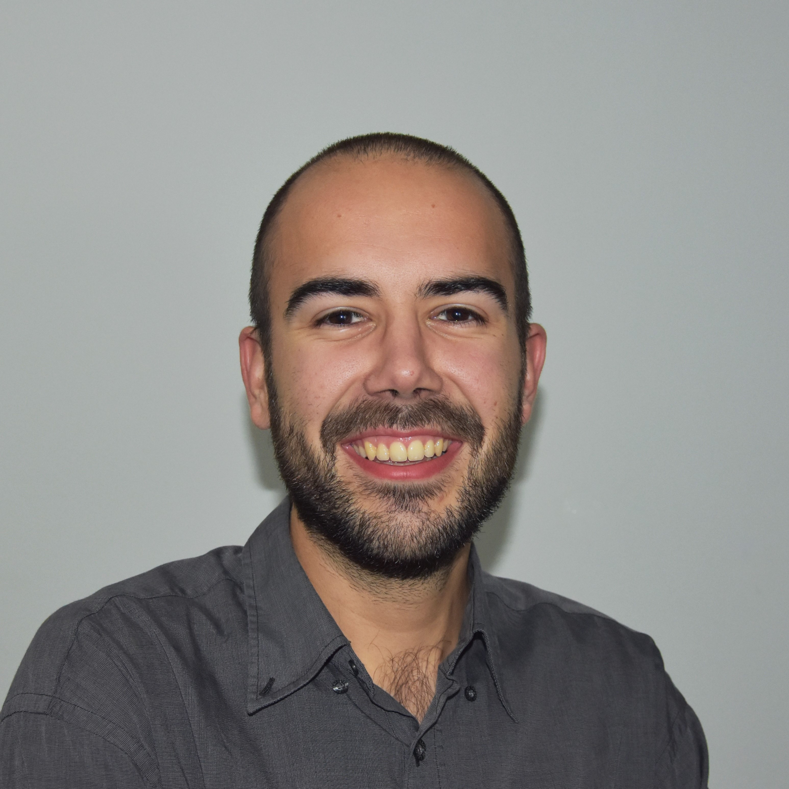
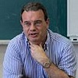
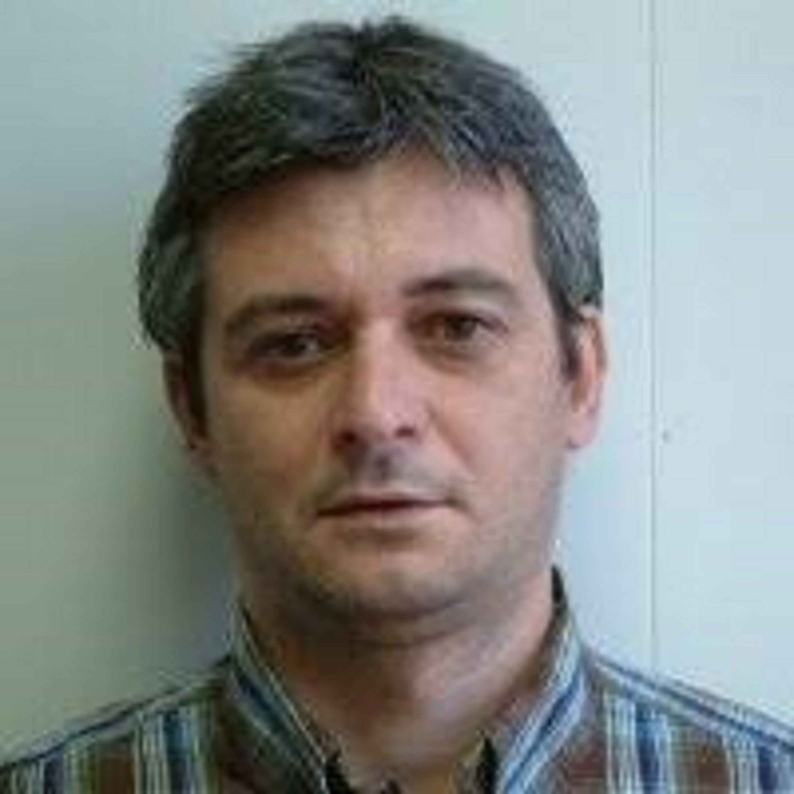
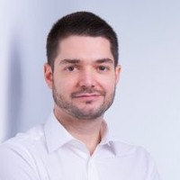

 *ENGLISH* |  [CASTELLANO](sobrenosotros.md) |  [CATALÀ](sobrenosaltres.md)

||||
| --------- |---------| ---------|
| <b>Eneko Lerma:</b> Eneko Lerma is graduated in Industrial Electronics and Automatic Engineering (2017) and currently cursing the Master's degree in Automatic Control and Robotics (MUAR) of the Technical University of Catalonia (UPC) in the ETSEIB.  | <b>Robert Griñó:</b> Robert Griñó received the M.Sc. degree in electrical engineering and the Ph.D. degree in automatic control from the UPC, Barcelona, Spain, in 1989 and 1997, respectively. Currently, he is an Associate Professor at the Automatic Control Department of the UPC, his teaching activity is related with the Industrial Engineering degree and the Master in Automation and Robotics (MUAR) from the ETSEIB. Dr. Griñó is an IEEE Senior Member.| <b>Ramon Costa:</b> Ramon Costa obtained the master degree in computer science in 1993 from the UPC, in 2001 he obtained the PhD degree at UPC. Currently, he is an Associate Professor at the Automatic Control department and the Control UPC, his teaching activity is related with the Industrial Engineering degree and the Master in Automation and Robotics (MUAR) from the ETSEIB. |

In collaboration with:

<b>Carlos Sanchis:</b> Carlos Sanchis is the Technical Specialist of Mathworks for Spain and Portugal. He is currently collaborating with the academic community to leverage MATLAB and Simulink for STEM (Science, Technology, Engineering and Mathematics) higher education and research. 

