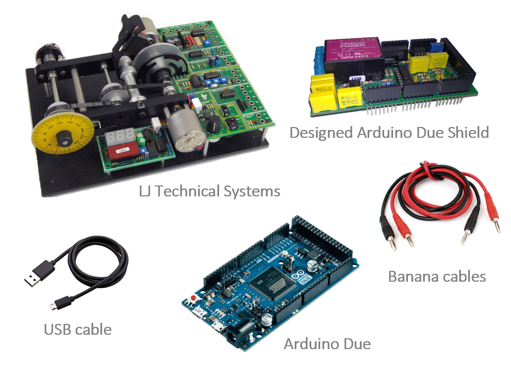
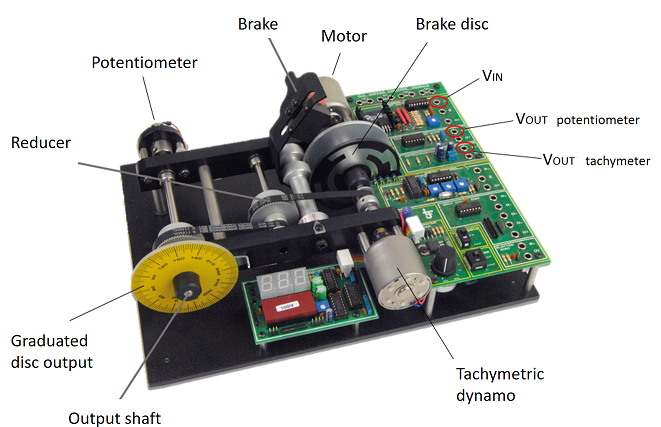
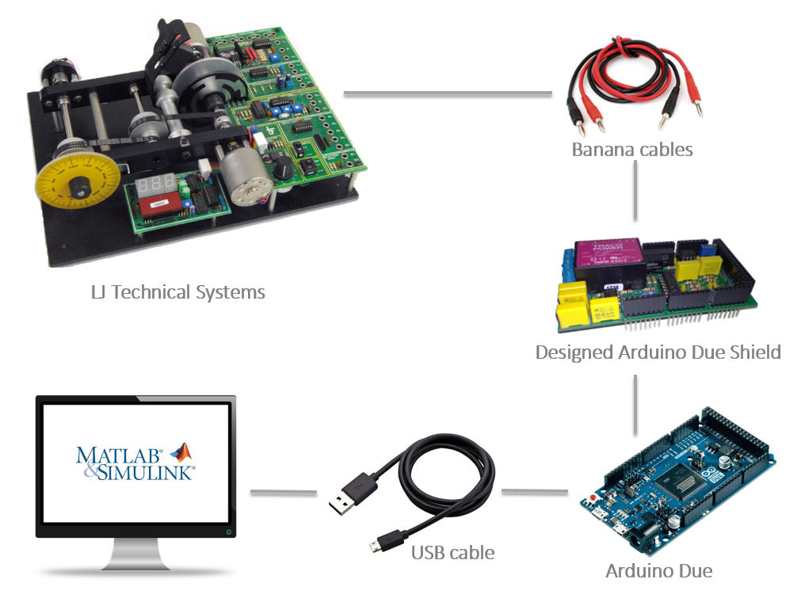

 *ENGLISH* |  [CASTELLANO](equipo.md) |  [CATALÀ](equip.md)

In order to realize the projects done in this web page, the items depicted in the figure below are needed.

<ul>
  <li><b>Arduino Due:</b> There exist similar Arduino boards which could be used. All of them have similar price but different computation
burden. In the project, the Arduino Due board was selected due to it high computation performance and the fact that ithas real DA converters (most of the Arduino board only have PWM output).</li>
  <li><b>LJ Technical Systems' servosystem:</b> adajn </li>
  
  
  
  
  
  <li><b>Arduino Due shield:</b> The input and output range of our plant is &plusmn 5v while the Arduino Due can only handle signals in the [0,3.3]v range. In order to avoid this problem, a signal conditioner in the shape of a shield has been designed.</li>
  <li><b>Banana cables:</b> This cables are used to connect the Arduino Due with our plant. By this cables, we are able to obtain and transfere data related to the input voltage and output voltages of the potentiometer and dynamo tachimeter. The connection to common ground between the Arduino and the servosystem is also done by this cables.</li>
  <li><b>USB cable:</b> The USB cable is used to connect the <i>programming port</i> of the Due to the computer.</li>
</ul>  

On the following images we can see the connection diagram of our complete system. 

