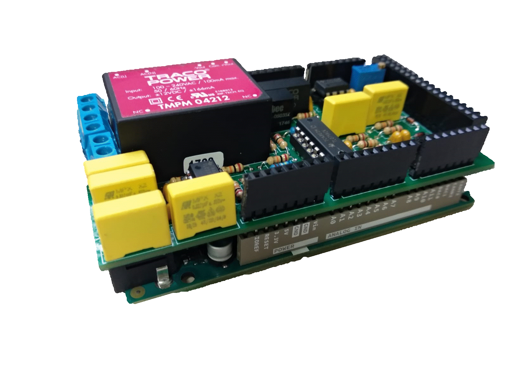
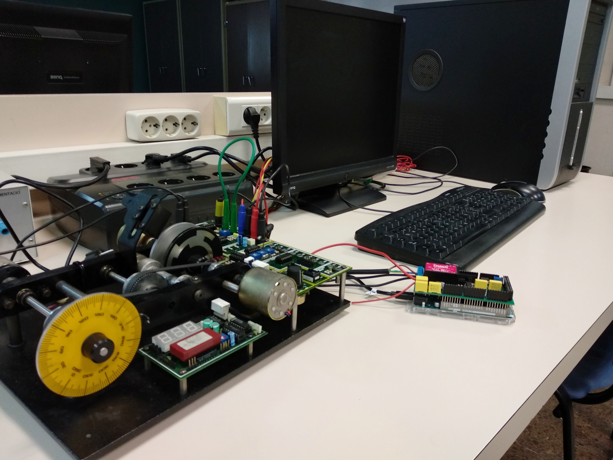

 *ENGLISH* |  [CASTELLANO](equipo.md) |  [CATALÀ](equip.md)

In order to realize the projects done in this web page, the items depicted in the figure below are needed.

<ul>
  <li><b>Arduino Due:</b> There exist similar Arduino boards which could be used. All of them have similar price but different computation burden. In the project, the Arduino Due board was selected due to it high computation performance and the fact that ithas real DA converters (most of the Arduino board only have PWM output).
  </li>
  <li><b>LJ Technical Systems' servosystem:</b> This motor module enables the user to perform closed-loop, positional or speed control of a DC motor. 
    The speed and direction of rotation of the motor can be controlled by either an analog signal or a pulse width modulated (PWM) signal. 
    Apart from this, speed of rotation and positional feedback information are available in both analog and digital forms, thus the module can be controlled by either an analog or digital system. 
  In this case, we will control the module by an analog signals, but the controller used to close the loop will be discrete, in this form we will use the Arduino as A/D and D/A converter. </li>
</ul>   

<ul>
  <li><b>Arduino Due shield:</b> The input and output range of our plant is &plusmn 5v while the Arduino Due can only handle signals in the [0,3.3]v range. In order to avoid this problem, a signal conditioner in the shape of a shield has been designed.</li>
</ul>   

<ul>
  <li><b>Banana cables:</b> This cables are used to connect the Arduino Due with our plant. By this cables, we are able to obtain and transfere data related to the input voltage and output voltages of the potentiometer and dynamo tachimeter. The connection to common ground between the Arduino and the servosystem is also done by this cables.</li>
  <li><b>USB cable:</b> The USB cable is used to connect the <i>programming port</i> of the Due to the computer.</li>
</ul>  

On the following images we can see the connection diagram of our complete system.  
On those projects the Arduino board has been programed by Simulink, but it can also be programed by MATLAB.  
  To program the Arduino by Simulink the Simulink support package for Arduino hardware is needed. This package enables you to create and run Simulink models on Arduino boards. More information can be found in <https://es.mathworks.com/hardware-support/arduino-simulink.html>.  
  To program the Arduino by MATLAB the MATLAB support package for Arduino hardware is needed.This package enables you to use MATLAB to communicate with an Arduino board. You can read and write sensor data through the Arduino and immediately see the results in MATLAB without having to compile. More information can be found in <https://es.mathworks.com/hardware-support/arduino-matlab.html>.  
  For more information about this packages you can search go to <https://es.mathworks.com/discovery/programacion-arduino.html>.

|||
| :---------: |:---------:|

