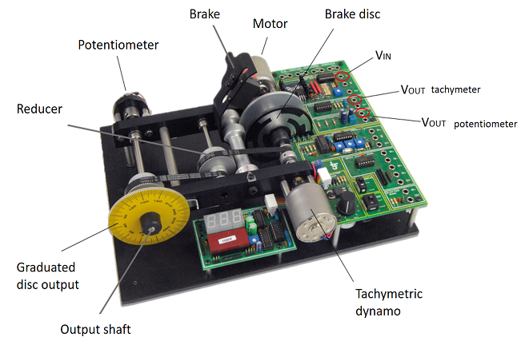

 [ENGLISH](equipment.md) |  *CASTELLANO* |  [CATALÀ](equip.md)

Para realizar los proyectos realizados en esta página web, se necesitan los elementos que se muestran en la siguiente figura.

<ul>
  <li><b>Arduino Due:</b> Existen varias placas similares de Arduino que podrían ser utilizados. Todos ellos tienen un precio similar pero diferente carga de computacional. Para este proyecto se ha seleccionado la placa Arduino Due debido a su alto rendimiento de computación y al hecho de que tiene convertidores D/A reales (la mayoría de la placa Arduino solo tiene salida PWM).
  </li>
  <li><b>LJ Technical Systems' servosystem:</b>Este módulo permite al usuario realizar un control de circuito cerrado, posicional o de velocidad de un motor de CC.     
    La velocidad y la dirección de rotación del motor se pueden controlar mediante una señal analógica o una señal modulada en ancho de pulso (PWM).     
    Aparte de esto, la velocidad de rotación y la información de realimentación posicional están disponibles en forma analógica y digital, por lo que el módulo puede ser controlado por un sistema analógico o digital.   En este caso, controlaremos el módulo mediante señales analógicas, pero el controlador utilizado para cerrar el bucle será discreto, de esta forma usaremos el Arduino como convertidor A / D y D / A </li>
</ul>   

<ul>
  <li><b>Arduino Due shield:</b> El rango de entrada y salida de nuestra planta es de &plusmn 5v, mientras que el Arduino Due solo puede manejar señales en el rango [0,3.3] v. Para evitar este problema, se ha diseñado un acondicionador de señal con forma de <i>shield<\i>.</li>
</ul>   

<ul>
  <li><b>Banana cables:</b> This cables are used to connect the Arduino Due with our plant. By this cables, we are able to obtain and transfere data related to the input voltage and output voltages of the potentiometer and dynamo tachimeter. The connection to common ground between the Arduino and the servosystem is also done by this cables.</li>
  <li><b>USB cable:</b> The USB cable is used to connect the <i>programming port</i> of the Due to the computer.</li>
</ul>  

On the following images we can see the connection diagram of our complete system.  
On those projects the Arduino board has been programed by Simulink, but it can also be programed by MATLAB.  
  To program the Arduino by Simulink the Simulink support package for Arduino hardware is needed. This package enables you to create and run Simulink models on Arduino boards. More information can be found in <https://es.mathworks.com/hardware-support/arduino-simulink.html>.  
  To program the Arduino by MATLAB the MATLAB support package for Arduino hardware is needed.This package enables you to use MATLAB to communicate with an Arduino board. You can read and write sensor data through the Arduino and immediately see the results in MATLAB without having to compile. More information can be found in <https://es.mathworks.com/hardware-support/arduino-matlab.html>.  
  For more information about this packages you can search go to <https://es.mathworks.com/discovery/programacion-arduino.html>.

