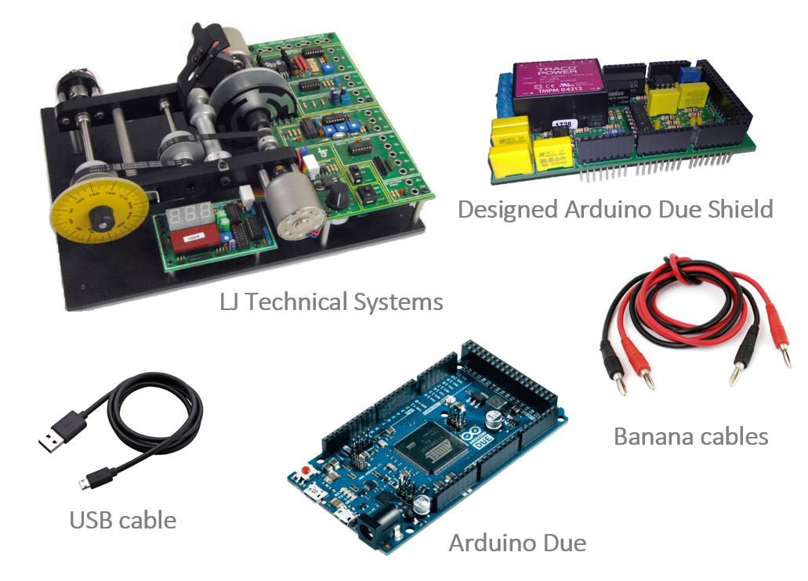

 [ENGLISH](equipment.md) |  *CASTELLANO* |  [CATALÀ](equip.md)

Para realizar los proyectos realizados en esta página web, se necesitan los elementos que se muestran en la siguiente figura.

<ul>
  <li><b>Arduino Due:</b> Existen varias placas similares de Arduino que podrían ser utilizados. Todos ellos tienen un precio similar pero diferente carga de computacional. Para este proyecto se ha seleccionado la placa Arduino Due debido a su alto rendimiento de computación y al hecho de que tiene convertidores D/A reales (la mayoría de la placa Arduino solo tiene salida PWM).
  </li>
  <li><b>Servosistema LJ Technical Systems:</b> Este módulo permite al usuario realizar un control de circuito cerrado, posicional o de velocidad de un motor de CC.     
    La velocidad y la dirección de rotación del motor se pueden controlar mediante una señal analógica o una señal modulada en ancho de pulso (PWM).     
    Aparte de esto, la velocidad de rotación y la información de realimentación posicional están disponibles en forma analógica y digital, por lo que el módulo puede ser controlado por un sistema analógico o digital.   En este caso, controlaremos el módulo mediante señales analógicas, pero el controlador utilizado para cerrar el bucle será discreto, de esta forma usaremos el Arduino como convertidor A / D y D / A </li>
</ul>   

<ul>
  <li><b>Arduino Due shield:</b> El rango de entrada y salida de nuestra planta es de &plusmn 5v, mientras que el Arduino Due solo puede manejar señales en el rango [0,3.3] v. Para evitar este problema, se ha diseñado un acondicionador de señal con forma de <i>shield</i>.</li>
</ul>   

El diseño del *shield* está disponible en: <https://github.com/DuinoBasedLearning/Lab/blob/master/Es/AdapSe%C3%B1al.pdf>, y los *gerbers* en <https://github.com/DuinoBasedLearning/Lab/blob/master/Common/Gerbers.zip>

<ul>
  <li><b>Cables Banana:</b> Estos cables se utilizan para conectar el Arduino Due con nuestra planta. Mediante ellos, podemos obtener y transferir datos relacionados con el voltaje de entrada y los voltajes de salida del potenciómetro y el dinamómetro. La conexión a tierra común entre el Arduino y el servosistema también se realiza mediante estos cables.</li>
  <li><b>USB cable:</b> El cable USB se usa para conectar el Arduino Due desde el <i>programming port</i> al ordenador.</li>
</ul>  

En las siguientes imágenes podemos analizar el diagrama de conexión de nuestro sistema.  
En estos proyectos, el Arduino ha sido programado mediante Simulink, pero también puede ser programado por MATLAB.  
  Para programar el Arduino mediante Simulink, se necesita el paquete de soporte de Simulink para Arduino. Este paquete permite crear y ejecutar modelos de Simulink en placas Arduino. Para más información <https://es.mathworks.com/hardware-support/arduino-simulink.html>.  
 Para programar el Arduino mediante MATLAB, se necesita el paquete de soporte de MATLAB para Arduino. Este paquete le permite usar MATLAB para comunicarse con una placa Arduino. Puede leer y escribir datos de sensores a través del Arduino e inmediatamente ver los resultados en MATLAB sin tener que compilar. Para más información <https://es.mathworks.com/hardware-support/arduino-matlab.html>.  
  Para más información sobre estos paquetes <https://es.mathworks.com/discovery/programacion-arduino.html>.

