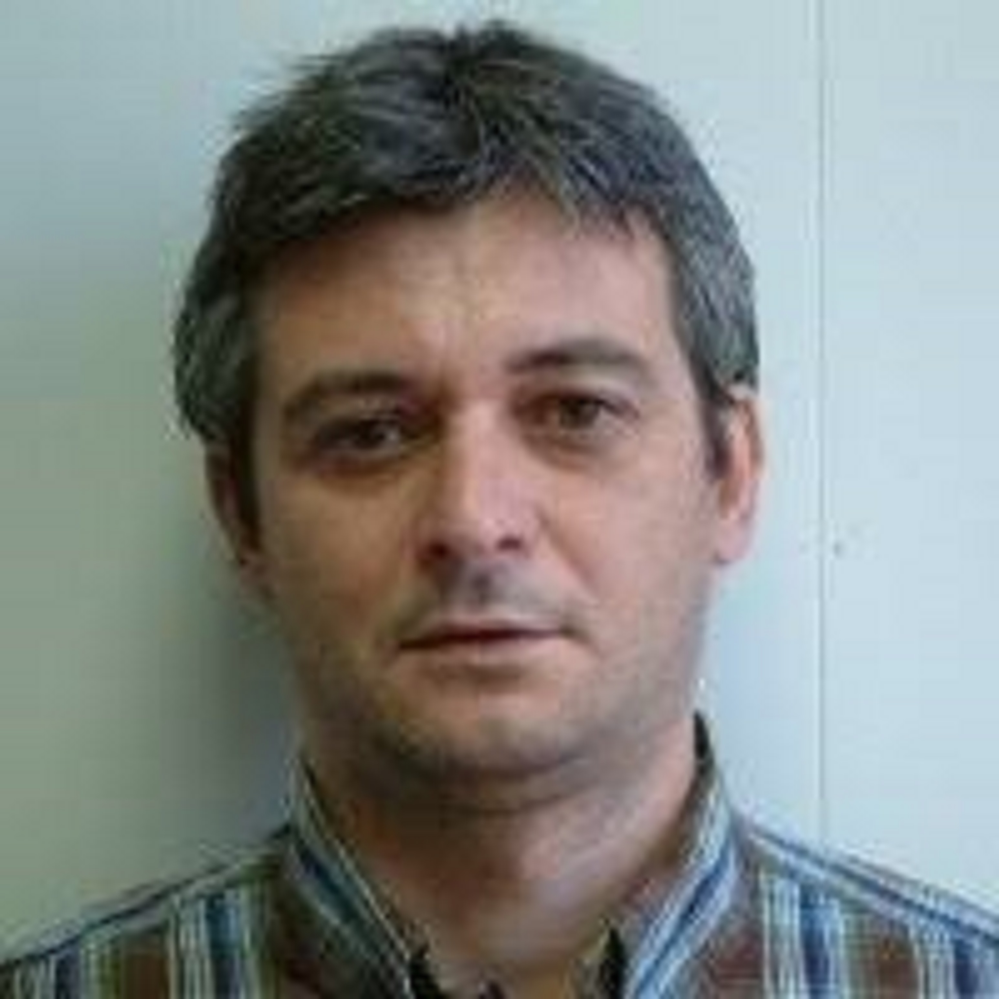
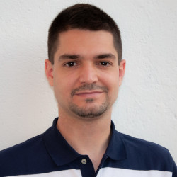

 [ENGLISH](about.md) |  [CASTELLANO](sobrenosotros.md) |  *CATALÀ*

||||
| --------- |---------| ---------|
| <b>Eneko Lerma:</b> Eneko Lerma es va graduar en enginyeria electrònica industrial i automàtica (2017) i actualment cursa el màster en Automàtica i Robòtica (MUAR) de la Universitat Politècnica de Catalunya (UPC) a l'Escola Tècnica Superior d'Enginyeria Industrial de Barcelona (ETSEIB). | <b>Robert Griñó:</b> Robert Griñó és Enginyer Industrial (1989) (esp. Elèctrica) i Dr. Enginyer Industrial (1997) per la Universitat Politècnica de Catalunya (UPC). Actualment, és professor associat al Departament d'Enginyeria de Sistemes, Automàtica i Informàtica Industrial (ESAII) i desenvolupa la seva recerca a l'Institut d'Organització i Control de Sistemes Industrials (IOC). La seva activitat docent està relacionada amb el grau d'Enginyeria Industrial i el Màster en Automàtica i Robòtica (MUAR) de l'ETSEIB. El Dr. Griñó és un membre sènior de IEEE.| <b>Ramon Costa:</b> Ramon Costa va obtenir el màster en ciències de la computació de la UPC el 1993, i el 2001 va obtenir el doctorat a la UPC. Actualment, és professor associat al Departament d'Enginyeria de Sistemes, Automàtica i Informàtica Industrial (ESAII) i la seva activitat docent està relacionada amb el grau d'Enginyeria Industrial i el Màster en Automàtica i Robòtica (MUAR) de l'ETSEIB. |

Amb la col·laboració de:

||
|:--------:|
|<b>Carlos Sanchis:</b> Carlos Sanchis és el tècnic especialista de Mathworks per a Espanya i Portugal. Actualment està col·laborant amb la comunitat acadèmica per aprofitar MATLAB i Simulink per a l'educació superior i recerca a STEM (Ciència, Tecnologia, Enginyeria i Matemàtiques).|
