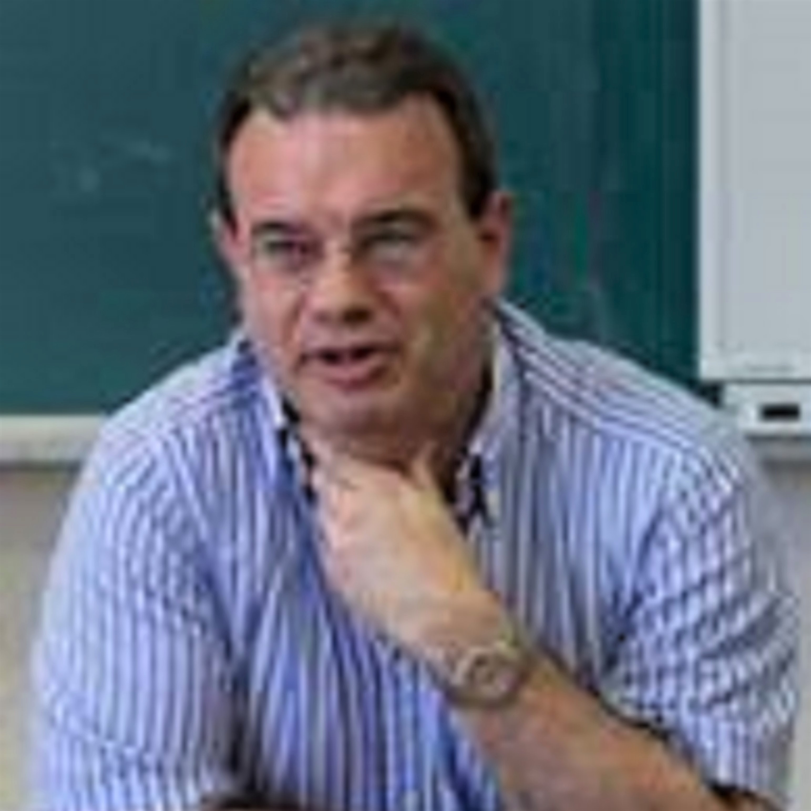

 [ENGLISH](about.md) |  *CASTELLANO* |  [CATALÀ](sobrenosaltres.md)

||||
| --------- |---------| ---------|
| <b>Eneko Lerma</b> se graduó en ingeniería electrónica industrial y automática (2017) y actualmente cursa el máster en Automática y Robótica (MUAR) de la Universidad Politécnica de Cataluña (UPC) en la Escuela Técnica Superior de Ingeniería Industrial de Barcelona (ETSEIB).  | <b>Robert Griñó</b> es Ingeniero Industrial (1989) (esp. eléctrica) y Dr. Ingeniero Industrial (1997) por la Universidad Politécnica de Cataluña (UPC). Actualmente, es profesor asociado en el Departamento de Ingeniería de Sistemas, Automática e Informática Industrial (ESAII) y desarrolla su investigación en el Instituto de Organización y Control de Sistemas Industriales (IOC). Su actividad docente está relacionada con el grado de Ingeniería Industrial y el Máster en Automática y Robótica (MUAR) de la ETSEIB. El Dr. Griñó es un miembro senior de IEEE.| <b>Ramon Costa</b> obtuvo el master en ciencias de la computación de la UPC en 1993, y en 2001 obtuvo el doctorado en la UPC. Actualmente, es profesor asociado en el Departamento de Ingeniería de Sistemas, Automática e Informática Industrial (ESAII) y su actividad docente está relacionada con el grado de Ingeniería Industrial y el Máster en Automática y Robótica (MUAR) de la ETSEIB. |

Con la colaboración de:

||
|:--------:|
|<b>Carlos Sanchis</b> es el técnico especialista de Mathworks para España y Portugal. Actualmente está colaborando con la comunidad académica para aprovechar MATLAB y Simulink para la educación superior e investigación en STEM (Ciencia, Tecnología, Ingeniería y Matemáticas).|
